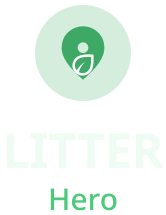
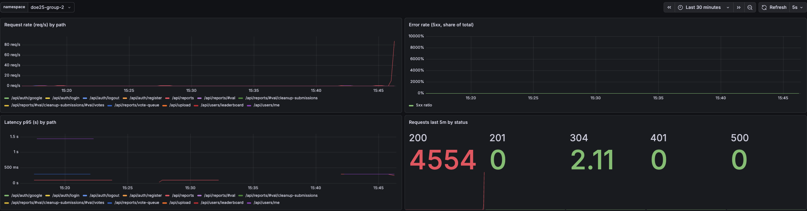

<p align="center">
  
</p>

# Litter Hero

Litter Hero is a community-driven web application for reporting litter and verifying cleanups. Users photograph trash, pin it on a map, and earn points for reporting and cleaning up. Cleanup proof is validated through **community voting**.

---

## Links

| Resource                   | URL                                                                                                                  |
| -------------------------- | -------------------------------------------------------------------------------------------------------------------- |
| **GitLab repository**      | [git.chas-lab.dev/chas-challenge-2026/grupp-2/grupp-2](https://git.chas-lab.dev/chas-challenge-2026/grupp-2/grupp-2) |
| **Live web app**           | [main-litter-hero.cc.k3s.chas-lab.dev](https://main-litter-hero.cc.k3s.chas-lab.dev/)                                |
| **Website login**          | BasicAuth                                                                                                            |
| **Backend API**            | [api-main-litter-hero.cc.k3s.chas-lab.dev](https://api-main-litter-hero.cc.k3s.chas-lab.dev/)                        |
| **Swagger UI**             | [api-main-litter-hero.cc.k3s.chas-lab.dev/api-docs](https://api-main-litter-hero.cc.k3s.chas-lab.dev/api-docs)       |
| **Demo video (repo file)** | [`demo/litter-hero-demo.mp4`](./demo/litter-hero-demo.mp4)                                                           |

---

## Project summary

Most environmental apps reward you for saying you did something. LitterHero only rewards what other users verify. Users report litter, upload cleanup evidence, and vote on each other's efforts - the same object is tracked from report to confirmed cleanup. Peer verification makes cheating pointless and engagement visible. Gamification on top means people do not clean up once, they keep going. Tech for good is about incentives - we have built the right loop.

---

## Tech for Good

**CHAS Challenge 2026 theme:** _Tech for Good_

| How we address the theme    | What it means in practice                                                         |
| --------------------------- | --------------------------------------------------------------------------------- |
| **Environmental impact**    | Makes litter visible on a map and tracks it from report to verified cleanup       |
| **Community empowerment**   | Peer voting verifies cleanups without top-down moderation                         |
| **Accessibility of action** | Mobile-first UI, camera capture, automatic location, and low friction reporting   |
| **Transparency**            | Open lifecycle states, vote outcomes, and points linked to verified actions       |
| **Sustainable engineering** | Cloud-native deployment on CHAS infrastructure with reproducible DevOps workflows |

---

## Table of contents

- [Features](#features)
- [Demo video](#demo-video)
- [Tech stack](#tech-stack)
- [Architecture](#architecture)
- [DevOps and infrastructure](#devops-and-infrastructure)
- [Getting started](#getting-started)
- [API documentation](#api-documentation)
- [Testing](#testing)
- [Accessibility and performance](#accessibility-and-performance)
- [Project structure](#project-structure)
- [Team](#team)

---

## Demo video

https://github.com/negarbaharmand/Litter-Hero/raw/main/demo/litter-hero-demo.mp4

- File in repo: [`demo/litter-hero-demo.mp4`](./demo/litter-hero-demo.mp4)

---

## Features

### Report litter

- Capture a photo via camera or file upload.
- Location from EXIF GPS, browser geolocation, or manual map picker.
- Categorize litter and estimate size (Small / Medium / Large).
- Anti-abuse safeguards: minimum image size checks, rate limiting, and nearby duplicate detection.

### Explore reports

- **Map view** with marker clustering, status filtering, and user location.
- **Reports list** with status badges, thumbnails, and detail links.
- **Report detail** page with cleanup submissions and voting state.

### Community cleanup verification

Users submit after-photos as cleanup proof. Submissions enter community voting:

| Rule             | Detail                                                     |
| ---------------- | ---------------------------------------------------------- |
| Vote threshold   | 3 votes per submission                                     |
| Outcome          | Majority **clean** approves cleanup; otherwise rejected    |
| Restrictions     | Reporter and submitter cannot vote on their own submission |
| Report lifecycle | `open` -> `cleanup_pending_vote` -> `cleaned`              |

Approved submissions mark reports as cleaned, expire competing pending submissions, and award points.

### Points and gamification

| Action           | Small | Medium | Large |
| ---------------- | ----: | -----: | ----: |
| Report litter    |   +10 |    +15 |   +20 |
| Approved cleanup |   +20 |    +30 |   +40 |

- Leaderboard with time-period filters.
- Profile stats for activity, points, reports, cleanups, and votes.
- Badge progression and streak-focused engagement features.

### Authentication and UX

- Email/password and Google OAuth sign-in (JWT-based sessions).
- Auth-gated reporting, cleanup submission, and voting.
- Mobile-first navigation and responsive desktop layout.
- Light/dark theme support.

---

## Tech stack

| Layer              | Technologies                                                                                  |
| ------------------ | --------------------------------------------------------------------------------------------- |
| **Frontend**       | React 19, TypeScript, Vite, React Router, TanStack Query, Tailwind CSS, Leaflet               |
| **Backend**        | Node.js, Express 5, TypeScript, Zod                                                           |
| **Database**       | PostgreSQL + PostGIS, Drizzle ORM, Drizzle Kit                                                |
| **Storage**        | Garage (S3-compatible)                                                                        |
| **Auth**           | JWT, bcrypt, Google OAuth                                                                     |
| **API docs**       | Swagger UI at `/api-docs`                                                                     |
| **Observability**  | Prometheus metrics (`express-prom-bundle`), ServiceMonitor, PrometheusRule, Grafana dashboard |
| **Infrastructure** | Docker, Kubernetes (k3s), Traefik, GitLab CI/CD                                               |
| **Security**       | Trivy image scanning in CI                                                                    |

---

## Architecture

```text
┌─────────────┐     HTTPS      ┌──────────────┐    /api/*     ┌─────────────┐
│   Browser   │ ──────────────▶│   Frontend   │ ─────────────▶│   Backend   │
│  (React SPA)│                │    (Nginx)   │               │  (Express)  │
└─────────────┘                └──────────────┘               └──────┬──────┘
                                                                      │
                                                    ┌─────────────────┼─────────────────┐
                                                    ▼                 ▼                 ▼
                                              ┌──────────┐    ┌──────────┐    ┌──────────┐
                                              │ PostGIS  │    │  Garage  │    │Prometheus│
                                              │    DB    │    │   (S3)   │    │ /metrics │
                                              └──────────┘    └──────────┘    └──────────┘
```

- React SPA served by Nginx in production.
- Nginx proxies `/api/*` to the Express backend.
- Backend persists business data in PostGIS and stores image objects in Garage.
- Metrics are exposed from backend and scraped by Prometheus.

---

## DevOps and infrastructure

### GitLab CI/CD pipeline

Defined in [`.gitlab-ci.yml`](./.gitlab-ci.yml):

| Stage       | What it does                                                                        |
| ----------- | ----------------------------------------------------------------------------------- |
| **Build**   | Builds frontend/backend/deploy images and pushes to GitLab Container Registry       |
| **Scan**    | Runs Trivy checks for HIGH/CRITICAL vulnerabilities and stores reports as artifacts |
| **Deploy**  | Deploys to CHAS k3s (review apps for branches, production for `main`)               |
| **Cleanup** | Manual cleanup for review environments                                              |

### Kubernetes

Manifests in [`k8s/`](./k8s/) include frontend/backend deployments, PostGIS resources, migration jobs, ingress, and monitoring objects.

### Monitoring snapshot



- Read full technical documentation in [`k8s/DEVOPS-README.md`](./k8s/DEVOPS-README.md).

---

## Getting started

### Prerequisites

- Docker and Docker Compose
- Copy [`.env.example`](./.env.example) to `.env` and configure needed values

### Run locally (recommended)

```bash
docker compose -f docker-compose.local.yml up -d --build
docker compose logs -f
```

| Service        | URL                            |
| -------------- | ------------------------------ |
| Frontend       | http://localhost:5173          |
| Backend API    | http://localhost:3000          |
| Swagger docs   | http://localhost:3000/api-docs |
| Drizzle Studio | http://localhost:4983          |

### Run without Docker

```bash
# Backend
cd backend && cp .env.example .env && npm install && npm run db:migrate && npm run dev

# Frontend (separate terminal)
cd frontend && cp .env.example .env && npm install && npm run dev
```

Set `VITE_API_URL=http://localhost:3000` in `frontend/.env` when not using the Nginx proxy.

---

## API documentation

Swagger UI:

- Production: [https://api-main-litter-hero.cc.k3s.chas-lab.dev/api-docs](https://api-main-litter-hero.cc.k3s.chas-lab.dev/api-docs)
- Local: [http://localhost:3000/api-docs](http://localhost:3000/api-docs)

| Group   | Base path      | Description                         |
| ------- | -------------- | ----------------------------------- |
| Auth    | `/api/auth`    | Register, login, Google OAuth       |
| Users   | `/api/users`   | Profile and leaderboard             |
| Reports | `/api/reports` | Reports, cleanup submissions, votes |
| Upload  | `/api/upload`  | Image upload to Garage              |

---

## Testing

### Backend unit tests

Core workflow logic (voting thresholds, size-based points, aggregation):

```bash
cd backend
npm test
```

See [`backend/src/controllers/reportWorkflow.test.ts`](./backend/src/controllers/reportWorkflow.test.ts).

---

## Accessibility and performance

- Accessibility audit and Lighthouse notes: [`Accessibility.md`](./Accessibility.md)
- Backend runtime metrics available at `/metrics`
- Monitoring and alerting configured via ServiceMonitor and PrometheusRule resources

---

## Project structure

```text
grupp-2/
├── frontend/                # React SPA
├── backend/                 # Express API + Drizzle schema/migrations
├── k8s/                     # Kubernetes manifests (deploy, ingress, monitoring)
├── scripts/                 # deploy/cleanup scripts
├── docker-compose.local.yml
├── .gitlab-ci.yml
├── Accessibility.md
└── CLEANUP_FLOW_SUMMARY.md  # Cleanup verification technical details
```

---

## Team

Contributors are visible in the repository commit history.
